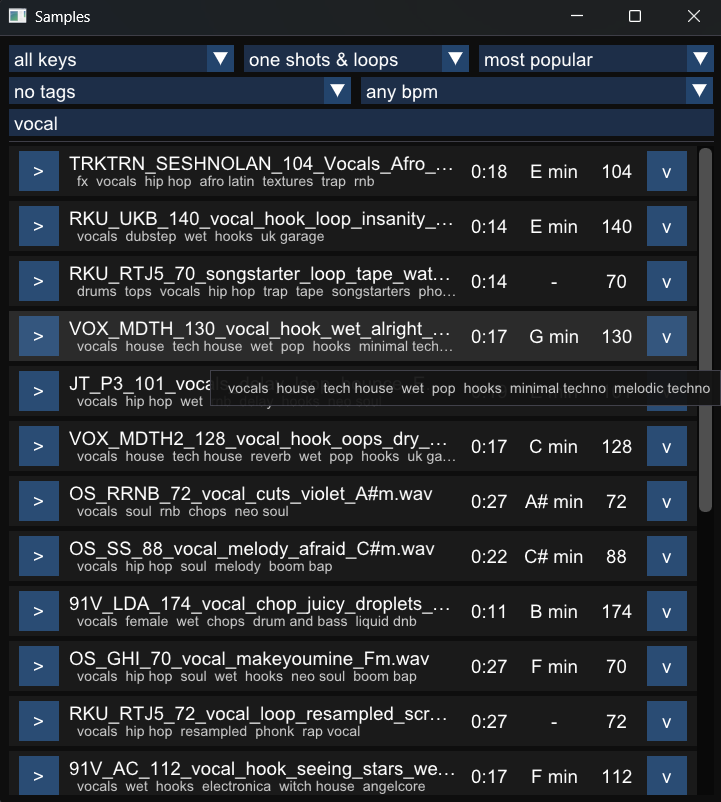

This is a [Dear Imgui](https://github.com/ocornut/imgui) frontend for [splice.com](https://splice.com) written in C, using libcurl for http requests

It allows you to search/filter sounds, and drag & drop them easily into your music/audio program

Drag & drop has only been implemented for Windows

This program encounters problems with cloudflare bot challenges, meaning searches don't always work. So future versions should bundle a JS runtime to solve them

